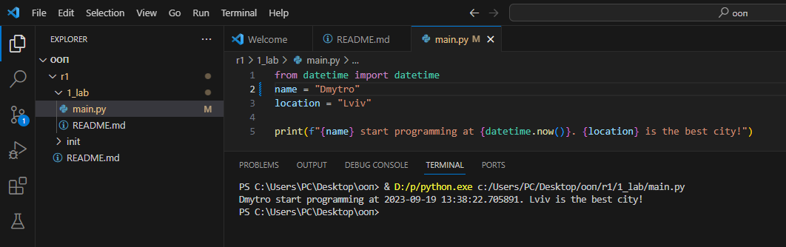

# Звіт до роботи
## Тема: _Оформення робіт та перша тема_
### Мета роботи: _Навчитись оформляти роботи в форматі Markdown та створити першу програму на Python_
---
### Виконання роботи
- Результати виконання завдання:
    1. Створили файл [з першою програмою](main.py)
    1. Програма вивела текст представлений на скріншоті 
    1. стоворили [python notebook `nb.ipynb`](nb.ipynb) та попрактикувалися в роботі з комірками, модифікували основну програму для роботи з бібліотекою `time`;
    1. Отриманірезультати виконання комірок python notebook представлено у [самому ноутбуці](nb.ipynb);
    1. Навчились створювати файли для прогми python та інтерактивно працювати у python notebook 
    1. Попрацювали  з ChatGPT та запитались як модифікувати програму на python. Результат вставлено у [python notebook `nb.ipynb`](nb.ipynb)
    1. Оформили звіт у форматі Markdown

- індивідуальних завдань не було;

### Висновок: 
> у висновку потрібно відповісти на запитання:
- :question: Що зроблено в роботі;
- :question: Чи досягнуто мети роботи;
- :question: Які нові знання отримано;
- :question: Чи вдалось відповісти на всі питання задані в ході роботи;
- :question: Чи вдалося виконати всі завдання;
- :question: Чи виникли складності у виконанні завдання;
- :question: Чи подобається такий формат здачі роботи (Feedback);
- :question: Побажання для покращення (Suggestions);
---
