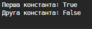
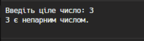
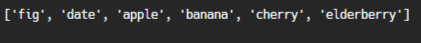

# Звіт до роботи №2
## Тема: _Основи програмування на Python_
### Мета роботи: _навчитись базовим конструкціям мови Python __
---
### Виконання роботи
- Результати виконання завданнь 
    1. Створили [Python Notebook](nb.ipynb) та почали виконувати завдання;
    1. Попрацювали зі стрічковими обєктами та спробували застосовувати до них додавання та множення; 
    1. Попрацювали з вбудованими константами, вбудованими функціями, циклами, розгалуженнями, контекст-менеджерами і лямбдами;
    1. Всі результати є в [самому ноутбуці](nb.ipynb);
    1. Навчились основам Python;
    1. індивідуальне завдання є в [Python Notebook](nb.ipynb) або в [пайтон файлі](main.py);
    ---

### Виконані приклади коду Python

> вставлені скріншоти:
```text
Скріншот до завдання 1
```
 

 ```text
Скріншот до завдання 5
```
 

  ```text
Скріншот до завдання 8
```
 


> вставлений код :

```text
Завдання 1. Попракитикуйтесь з простими змінними, списками list, наборами set та словниками dict:
```

```python
print("Перша константа:", True)

print("Друга константа:", False)
```

```text
Завдання 2. Виведіть вбудовані константи:

Результат: 
True: True
False: False
```

```python
print("True:", True)
print("False:", False)
```


```text
Завдання 3. Виведіть результат роботи вбудованих функцій:
Результат: Довжина списку 5
```

```python
my_list = [1, 2, 3, 4, 5]
length = len(my_list)
print("Довжина списку:", length)
```

```text
Завдання 4. Познайомтесь з циклами:
```

```python
# приклад циклу while
i = 1
while i <= 5:
    print(i)
    i += 1

# приклад циклу for
for i in range(1, 6):
    print(i)
```

```text
Завдання 5. познайомтесь з розгалуженнями:
```

```python
# Зчитуємо число від користувача
number = int(input("Введіть ціле число: "))

# Перевіряємо, чи число парне чи непарне
if number % 2 == 0:
    print(f"{number} є парним числом.")
else:
    print(f"{number} є непарним числом.")
```

```text
Завдання 6. Конструкція try->except->finally:
```

```python
# ми не визначили змінну яку хочемо надрукувати

#print(aa) #тут буде помилка бо немає такої змінної

try:
    print(aa)
except NameError:
    # тут ми можемо опрацювати помилку та написати код що робити якщо помилка виникла
    print("ми не іцініалізували змінну аа") 
    
nn = [random.randint(0, 5) for i in range(10)]
print(f"згенеровано набір випадкових чисел від 0 до 5, їх вигляд: {nn}")
for n in nn:
    try:
        print(f"ми змогли поділити число 5 на {n} = {5/n}")
    except ZeroDivisionError:
        print(f"ми не можемо ділити на {n}, тому просто додамо  1")  
        n += 1
    finally: 
        print(f"результат ділення після корекції буде {n} = {5/n}")
```

```text
Завдання 7. Контекст-менеджер:
```

```python
# Відкриття файлу для запису з використанням контекст-менеджера
with open("my_file.txt", "w") as file:
    file.write("Це приклад використання контекст-менеджера для запису в файл.\n")
    file.write("Цей файл створений з використанням Python.\n")
    file.write("Це останній рядок у файлі.")
# Файл автоматично закриється після виходу з контексту

# Тепер ми відкриємо файл для читання і виведемо його вміст
with open("my_file.txt", "r") as file:
    for line in file:
        print(line, end="")
```

```text
Завдання 8. Познайомтесь з Python lambdas:
```

```python
# Список рядків для сортування
words = ["apple", "banana", "cherry", "date", "elderberry", "fig"]

# Використання лямбда-функції для сортування за довжиною рядка
sorted_words = sorted(words, key=lambda x: len(x))

# Виведення відсортованого списку
print(sorted_words)
```


### Висновок: 
> у висновку потрібно відповісти на запитання:
- :question: Що зроблено в роботі; - познайомились з основами Python.
- :question: Чи досягнуто мети роботи; - так.
- :question: Які нові знання отримано; - базові знання з Python.
- :question: Чи вдалось відповісти на всі питання задані в ході роботи; - так.
- :question: Чи вдалося виконати всі завдання; - так.
- :question: Чи виникли складності у виконанні завдання; - ні .
- :question: Чи подобається такий формат здачі роботи (Feedback); - так.
- :question: Побажання для покращення (Suggestions); - немає.
---