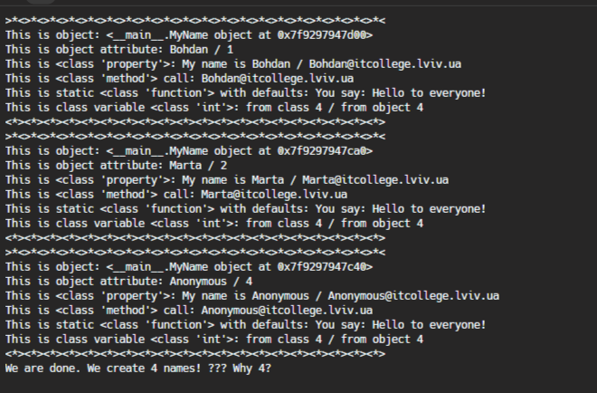

# Звіт до роботи №3
## Тема: _Знайомство з ООП_
### Мета роботи: _навчитись працювати та створювати власні класи в Python_
---
### Виконання роботи
- Результати виконання завдання:
    1. Підготували папку та файли для виконання роботи, [Python Notebook](nb.ipynb);
    1. Розробили власний клас що описує Клуб любителів домашніх тварин;
    1. Створили різні обєкти класу, пробували атрибути, методи та класові методи;
    1. Винесли наш клас та створили [власну бібліотеку](modules/my.py), та попрацювали з її імпортами у файлі [nb.py](nb.py);
    1. Вивід програми представлений на скріншотах;  
    1. Навчились створювати класи та працювати з бібліотеками.

Скріншот того, що вивела програма:
 

 Відповіді на питання:
 1. Причина, чому об’єкт із назвою "Anonymous" створюється, коли значення None передається класу MyName, пов’язано зі способом визначення методу __init__. Коли метод __init__ отримує None як параметр імені, він призначає значення «Anonymous» атрибуту name новоствореного об’єкта за допомогою тернарного оператора (name, якщо name не None else self.anonymous_user().name). Це гарантує, що навіть якщо передано None, завжди буде ім’я, пов’язане з об’єктом.

2. Щоб змінити текст привітання під час виклику методу say_hello(), ви можете змінити тіло методу, включивши потрібне повідомлення. Ось оновлений код:
```python
class MyName:
    """Опис класу / Документація
    """
    total_names = 0  # Class Variable

    def __init__(self, name=None) -> None:
        self.name = name if name is not None else self.anonymous_user().name  # Class attributes / Instance variables
        MyName.total_names += 1  # modify class variable
        self.my_id = self.total_names

    @property
    def whoami(self):
        """Class property
        return: повертаємо імя
        """
        return f"My name is {self.name}"

    @property
    def my_email(self) -> str:
        """Class property
        return: повертаємо емейл
        """
        return self.create_email()

    def create_email(self) -> str:
        """Instance method
        """
        return f"{self.name}@itcollege.lviv.ua"

    @classmethod
    def anonymous_user(cls):
        """Classs method
        """
        return cls("Anonymous")

    @staticmethod
    def say_hello(message="Welcoming everyone to the class!"):  # Modified greeting text
        """Static method
        """
        return f"You say: {message}"


print("Let's Start!")

names = ("Bohdan", "Marta", None)
all_names = {name: MyName(name) for name in names}

for name, me in all_names.items():
    print(f"""{">*<"*20}
This is object: {me}
This is object attribute: {me.name} / {me.my_id}
This is {type(MyName.whoami)}: {me.whoami} / {me.my_email}
This is {type(me.create_email)} call: {me.create_email()}
This is static {type(MyName.say_hello)} with defaults: {me.say_hello()}
This is class variable {type(MyName.total_names)}: from class {MyName.total_names} / from object {me.total_names}
{"<*>"*20}""")

print(f"We are done. We create {me.total_names} names! ??? Why {MyName.total_names}?")

```

3. Щоб додати функцію, яка підраховує кількість букв в імені, ви можете визначити новий метод у класі MyName:
```python
class MyName:
    # ... Existing class definition ...

    def count_letters(self):
        """
        Counts the number of letters in the name.

        Returns:
            int: The number of letters in the name.
        """
        return len(self.name.lower())
my_name = MyName("dmytro")
number_of_letters = my_name.count_letters()
print(f"The name {my_name.name} has {number_of_letters} letters.")

```

4. Розбіжність у кількості імен виникає через різні області видимості змінних класу та змінних екземпляра.

Змінні класу, такі як total_names, є спільними для всіх екземплярів класу. Зміна змінної класу впливає на всі екземпляри. У цьому випадку метод __init__() збільшує змінну класу total_names для кожного створеного екземпляра.

Змінні екземпляра, такі як name і my_id, є унікальними для кожного екземпляра. Зміна змінної екземпляра впливає лише на цей конкретний екземпляр.


### Висновок: 
> у висновку потрібно відповісти на запитання:
- :question: Що зроблено в роботі; - Розробили власний клас
- :question: Чи досягнуто мети роботи; - так
- :question: Які нові знання отримано; - дізнався як створювати клас 
- :question: Чи вдалось відповісти на всі питання задані в ході роботи; - так
- :question: Чи вдалося виконати всі завдання; - так
- :question: Чи виникли складності у виконанні завдання; - ні
- :question: Чи подобається такий формат здачі роботи (Feedback); - так
- :question: Побажання для покращення (Suggestions); - немає
---