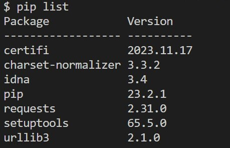
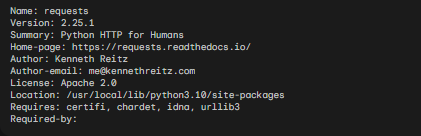
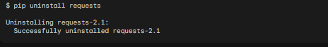

# Звіт до роботи
## Тема: _Робота з віртуальними середовищими_;
### Мета роботи: _навчитись створювати та працювати у віртуальних середовищах_;
---
### Виконання роботи
- Результати виконання завдання:
    1. Створили віртуальні середовища за довомогою `venv` та `pipenv`. Інсталювали різні бібліотеки у середовища та порацювали з ними;
    1. Створили віртуальне середовище за допомогою `venv` та подивились які там є встановлені бібліотеки 
    1. Теж саме виконали за допомогою `pipenv`;
    1. Програма вивела значення: показуємо на сріншотах де програма виконувалась а де видавала помилку;
    1. Навчились працювати з віртуальними середовищами;
- вставлені рисунки наведені нижче, демонструють процес виконання роботи по кожному з кроків. 

- код програм записаний у файлах: Веб сайт написаний на Flask знаходиться у файлі [app.py](./app.py), а  тестовий код є у файлі [my.py](./my.py)

- результати виконання індивідуального завдання: 
1. дії можна зробити за допомогою pip:
 - Видалення пакетів
 - Оновлення пакетів
 - Перегляд встановлених пакетів
 - Пошук пакетів
 - Імпортування пакетів
1. Результат: 200
```python
install requests

python #Зайдіть в пайтон інтерпретатор

>>> import requests

>>> r = requests.get('https://google.com')

>>> r.status_code

>>> exit()
```
1. 
pip show requests:

pip uninstall requests:


1. Цей код створює віртуальне середовище Python, встановлює пакет requests, а потім видаляє віртуальне середовище.

Перша команда, python -m venv ./my_env, створює віртуальне середовище Python у каталозі ./my_env. Віртуальне середовище - це ізольований простір, у якому можна встановлювати та використовувати пакети Python, не зачіпаючи глобальний простір.

Друга команда, source my_env/Scripts/activate, активує віртуальне середовище. Коли віртуальне середовище активовано, його пакети будуть доступні для використання.

Третя команда, pip install requests, встановлює пакет requests у віртуальному середовищі. Пакет requests надає API для взаємодії з веб-сервісами.

Четверта команда, deactivate, деактивує віртуальне середовище. Коли віртуальне середовище деактивовано, його пакети більше не будуть доступні.

П'ята команда, pip show requests, виводить інформацію про пакет requests. Ця інформація включає назву пакету, версію, автора та інші відомості.

```python 
python -m venv ./my_env
source my_env/Scripts/activate
pip install requests
deactivate
pip show requests
```

1.  команди які можна виконувати за допомогою pipenv:
 - Створення віртуального середовища
 - Активація віртуального середовища
 - Видалення віртуального середовища
 - Установка пакетів
 - Видалення пакетів
 - Оновлення пакетів
 - Перегляд встановлених пакетів
 - Пошук пакетів
 - Імпортування пакетів

 1. Pipfile містить наступний вміст:

[[source]]
name = "pypi"
url = "https://pypi.org/simple"
verify_ssl = true

[dev-packages]

[packages]
requests = "*"

[requires]
python_version = "3.8"

Pipfile.lock містить наступний вміст:

[[metadata.packages]]
name = "requests"
version = "2.25.1"

[[metadata.packages]]
name = "pytest"
version = "6.2.4"

1. Якщо виконати скрипт без активації віртуального середовища, то пакети, які використовуються у скрипті, будуть встановлені у глобальному просторі. Це може призвести до проблем, якщо скрипт буде використовуватися в різних проектах з різними наборами пакетів.


### Висновок: 
> у висновку потрібно відповісти на запитання:
- :question: Що зроблено в роботі; - створено віртуальне середовище.
- :question: Чи досягнуто мети роботи; - так.
- :question: Які нові знання отримано; - навчився створювати віртуальне середлвище.
- :question: Чи вдалось відповісти на всі питання задані в ході роботи; - так.
- :question: Чи вдалося виконати всі завдання; - так.
- :question: Чи виникли складності у виконанні завдання; - ні.
- :question: Чи подобається такий формат здачі роботи (Feedback); - так.
- :question: Побажання для покращення (Suggestions); - немає.
---